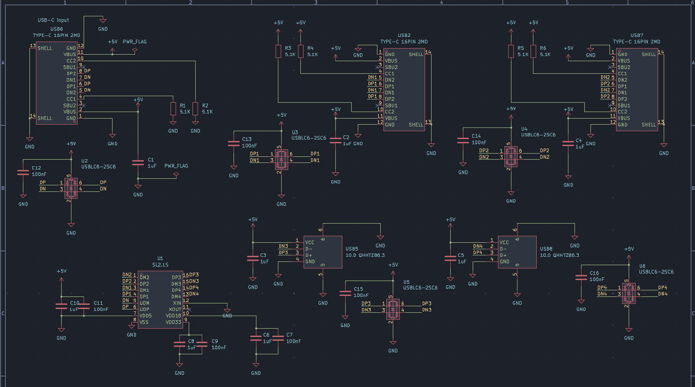
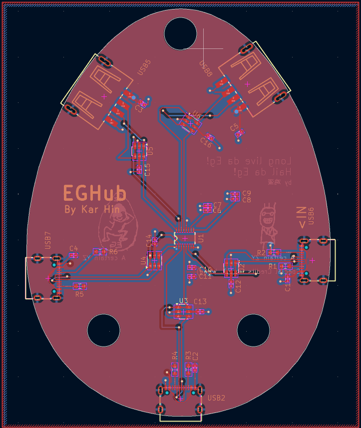
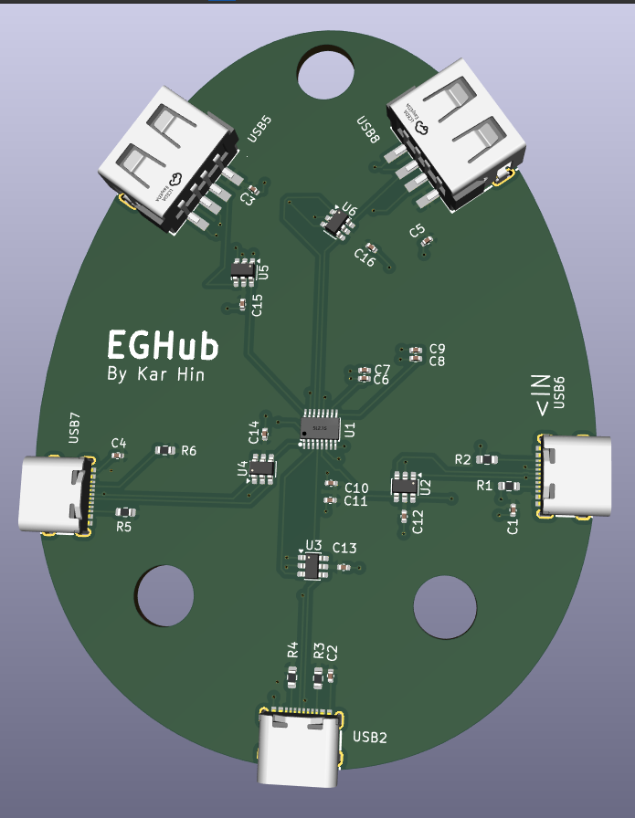
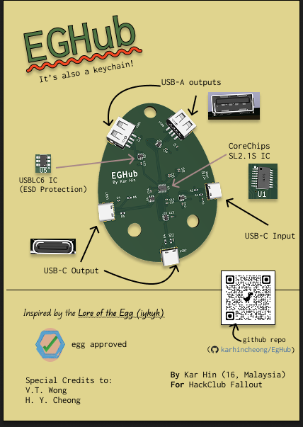

# Eg USB Hub

A 4-port output USB Hub keychain in the shape of an egg as a tribute to my friends. Main IC being CoreChips SL2.1S

## Motivation

This project is meant to be a try-out project for Fallout. It is to function as a primer for me to learn to make/design a PCB and at the same time make something useful.

## BOM

### Components List

<!-- prettier-ignore-start -->

|Item|Description|Quantity|Unit Price (USD)|Total Price (USD)|URL|Notes|
|---|---|---|---|---|---|---|
|Capacitor|0402 1 uF|16|0.0038|0.380|https://www.lcsc.com/product-detail/C29266.html|MOQ=100|
||0402 100 nF|16|0.0014|0.14|https://www.lcsc.com/product-detail/C14663.html|MOQ=100|
|Resistor|0603 5.1 kΩ|12|0.0016|0.16|https://www.lcsc.com/product-detail/C23186.html|MOQ=100|
|USB-A Receptacle||4|0.0665|0.665|https://www.lcsc.com/product-detail/C668591.html|MOQ=10|
|USB-C Receptacle||6|0.0741|1.482|https://www.lcsc.com/product-detail/C2765186.html|MOQ=20|
|CoreChips SL2.1S ||2|0.2849|1.4245|https://www.lcsc.com/product-detail/C2684433.html|MOQ=5|
|USBLC6-2SC6 ||16|0.154|3.080|https://www.lcsc.com/product-detail/C7519.html|MOQ=20|
|PCB (JLCPCB) Order||1|2.0000|2.0000|https://www.jlcpcb.com|MOQ=5|
||||||||
|TOTAL (for 2 units)||||9.33|||
|Component Cost per Unit||||4.67|||

<!-- prettier-ignore-end -->

### Additional Costs Incurred

| Item     | Description                 | Price (USD) |
| -------- | --------------------------- | ----------- |
| Shipping | UPS Worldwide Express Saver | 9.24        |

## Schematic Diagram

## PCB Layout

## PCB Render

## Project Zine

